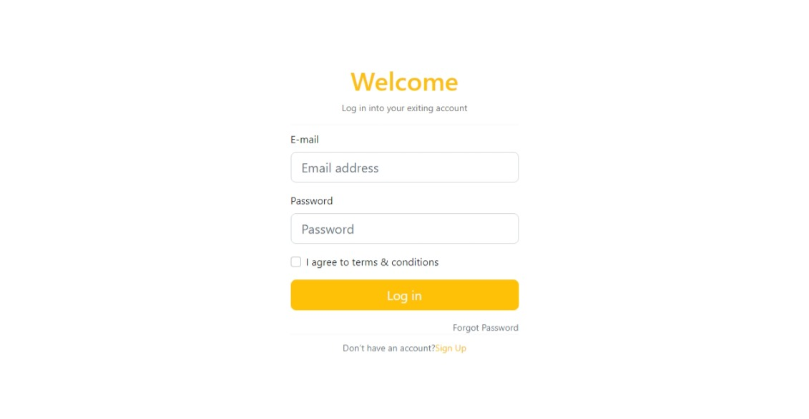
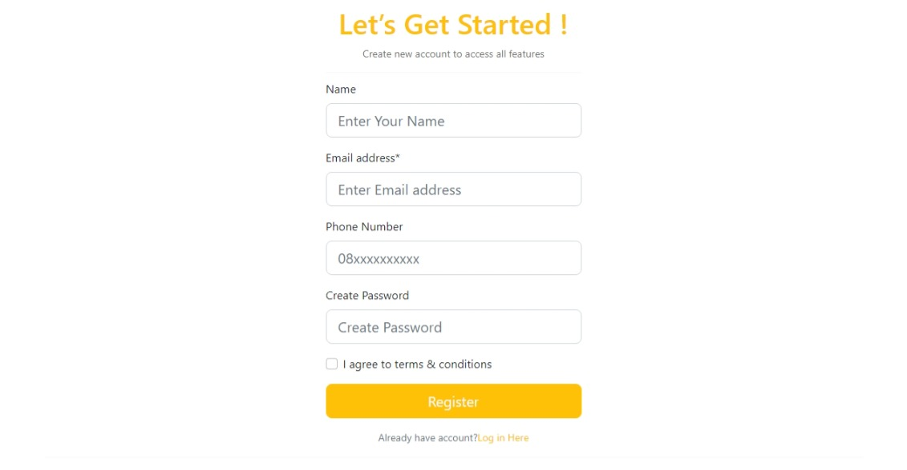
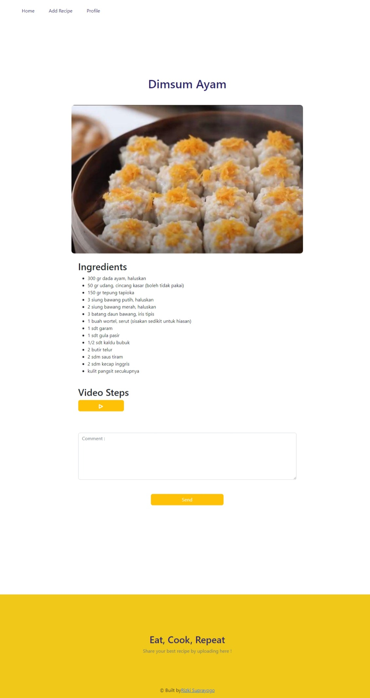
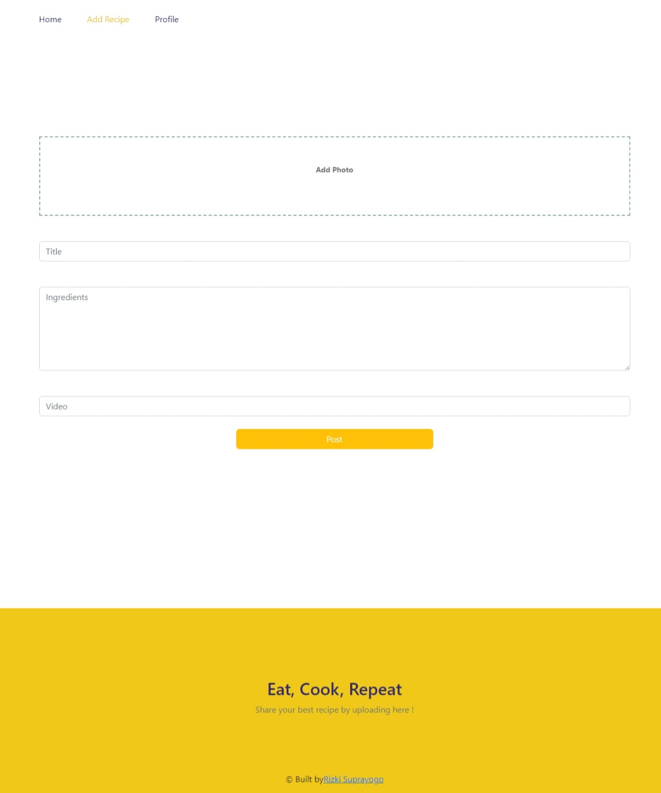
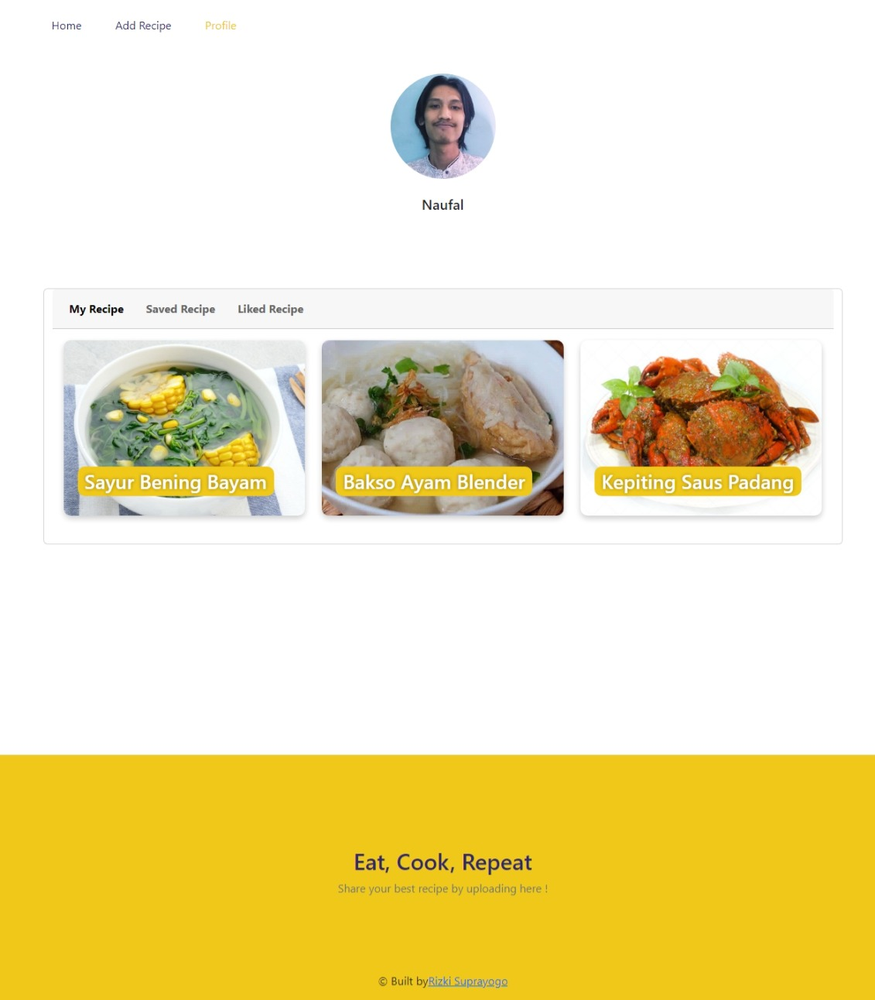

<h3 align="center">Food Recipe</h3>
<p align="center">
  <a href="https://rizki-suprayogo-learn-react-fe.vercel.app/">View Demo</a>
</p>

<!-- ABOUT THE PROJECT -->
## About The Project

Food Recipe is a web application for sharing recipes with features to register, login, forgot password, edit profile, create recipes, edit recipes, delete recipes, comments, and also features to  recipe videos. This web application is built using ReactJS, ExpressJS, and PostgreSQL.

### Technology Used
- [ReactJS](https://reactjs.org/)
- [Redux](https://redux.js.org/)
- [Bootstrap](https://getbootstrap.com/)
- [Axios](https://github.com/axios/axios)

 
<!-- GETTING STARTED -->
## Getting Started

### Installation
- Clone This Repository

`https://github.com/suprayogo/Food-Recipe-FE.git`

- Install Module

`npm install`

- Setting .env

```bash
REACT_APP_BASE_URLL=YOUR_API_URL
```

### Executing program

- Run this project with `npm run start`.

<!-- SCREENSHOT -->
## Screenshot
<hr>

### Login


### Register


### Landing


### Detail Recipe



### Add Recipe



### Profile


<!-- RELATED PROJECT -->
## Related Project

- [Food Recipe API](https://github.com/suprayogo/pijar-food-be-new)
- [Food Recipe Demo](https://rizki-suprayogo-learn-react-fe.vercel.app/)

<!-- CONTACT INFO -->
## Contact Info

Contributors names and contact info:

1. Rizki Suprayogo

- [Linkedin](https://www.linkedin.com/in/rizki-suprayogo/)


